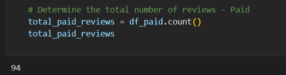
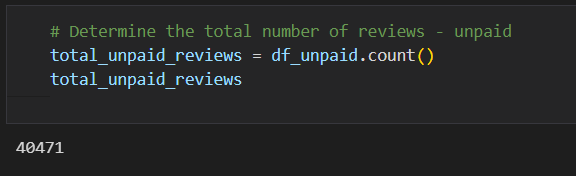
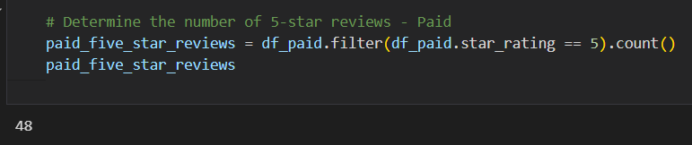
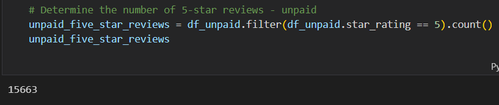
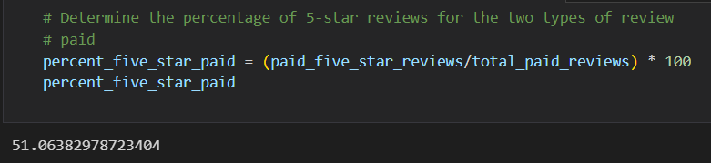
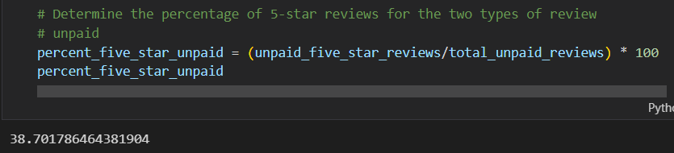

# Amazon Vine Analysis

##### Jupyter Files: [Amazon_Reviews_ETL](Amazon_Reviews_ETL.ipynb), [Amazon_Vine_Analysis](Amazon_Vine_Analysis.ipynb)

---

## Project Overview:

The Amazon Vine program is a service that allows manufacturers and publishers to receive reviews for their products. Companies like SellBy pay a small fee to Amazon and provide products to Amazon Vine members, who are then required to publish a review.

The data that was selected and analyzed for this project was for gaming products. Using PySpark, ETL was performed to extract the dataset, transform, and connect to an AWS RDS instance and then loaded to pgAdmin.

After the ETL process has been performed on the original gaming dataset, PySpark will be used to determine any bias towards favorable reviews from the Vine members dataset. This analysis will then be submitted to the SellBy stakeholders.

---

## Results:

#### Total Reviews

- Total Vine Reviews (Paid)

- Total Non-Vine Reviews (Unpaid)

#### Total 5 Star Reviews

- Total Vine 5 Star Reviews (Paid)

- Total Non-Vine 5 Star Reviews unpaid)

#### Percentage of 5 Star Reviews

- Percent of 5 star reviews Vine (Paid)

- Percent of 5 star reviewsd Non-Vine (Unpaid)

---

## Summary:

According to the analysis on gaming products, we can see that there is a positive bias for reviews that are Vine (paid). The total number of Vine (paid) reviews equates to 94, while the total number of Non-Vine (unpaid) reviews is 40471. While there is a larger number of unpaid reviews, the percentage of Non-Vine 5 star reviews is only ~38.7% versus the Vine (paid) reviews is ~51.1%. This means that there is a positive bias towards the Vine (paid) members and it would be suggested to only use Vine (paid) reviews for these products to give the products a higher review rating on Amazon.

Additional analysis to support this positive bias statement would be to look closer at other statistical analysis such as mean, median, mode, p-values, standard deviations, and any potential linear regression relationships.
